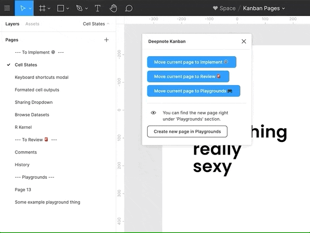

## Deepnote Kanban

Deepnote tracks the status of designs by moving them into a page section in Figma. It's not fun dragging a page across 50 other pages and there are no shortcuts to help us with this afaik 😢

This is a simple plugin to move the currently selected page to the right place (or to create a new page in playgrounds if you are cooking up something new).

**Example**

## How to run this

1. You must have the Figma desktop app to run this
2. Download this repo and unzip it
3. Go to Plugins > Development > New Plugin
4. Link an existing plugin by pointing Figma to the `manifest.json` in this folder
5. Find it in Plugins > Development > Deepnote Kanban

## How to use this

This is opinionated towards our workflow at [Deepnote](https://www.deepnote.com/). But it works great, so I highly recommend trying it out. Simply create `--- To Implement ---`, `--- To Review ---` and `--- Playgrounds ---` pages (or feel free to change the hardcoded values in `code.ts`) and use as shown in the `.gif`.
